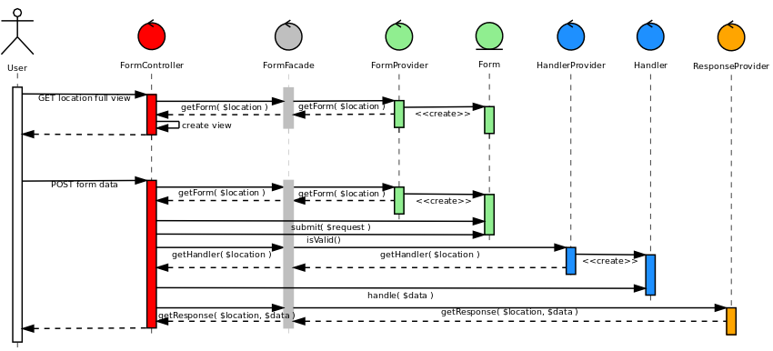

# ezforms-bundle documentation

## Architecture overview

This bundle comes with a default facade that delegates 3 things to 3 different services:

- *Form provider:* knows which form to display at the right location
- *Handler provider:* knows which service should handle user data once form is validated
- *Response provider:* knows where user should be redirected once data has been handled

Out of the box, a default response provider is used, redirecting to the `confirm` view of current location.
However, you must create form and handler providers suiting your custom needs.

Here's a quick overview of how it works:

## Resources

You can find a [tutorial on how to use the bundle](http://share.ez.no/learn/ez-publish/create-a-feedback-form-in-ez-publish-5-using-ezforms-bundle) on share.ez.no

You may also want to check detailed documentation on the following parts, including utility classes included in this bundle:

- [Form providers](01-form-providers.md)
- [Handler providers](02-handler-providers.md)
- [Handlers](03-handlers.md)
- [Views](04-views.md)
- [Response providers](05-response-providers.md)
- [Form facade](06-form-facade.md)
- [Configuration](07-configuration.md)
